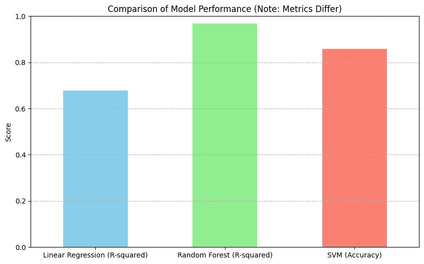

### _Summary_
# 📊 Prediksi Harga Rumah di California

Notebook ini berisi proses lengkap dalam membangun model prediksi harga rumah di California 
berdasarkan dataset dari [Kaggle](https://www.kaggle.com/datasets/camnugent/california-housing-prices). 

Kami menerapkan alur standar Machine Learning, mulai dari _EDA, Preprocessing, Feature Engineering,_ hingga penerapan beberapa model regresi dan klasifikasi.

---

## 🔍 Deskripsi Dataset

Dataset berisi berbagai fitur terkait properti perumahan di California, seperti:

* Jumlah kamar tidur dan total kamar
* Populasi dan jumlah rumah tangga
* Lokasi (latitude dan longitude)
* Kedekatan dengan laut (`ocean_proximity`)
* Nilai tengah harga rumah (`median_house_value`), yang menjadi target prediksi

---

## ⚙️ Langkah-Langkah Analisis

### 1. **Exploratory Data Analysis (EDA)**

* Pemeriksaan tipe data dan nilai yang hilang (null)
* Pembersihan data dengan menghapus baris kosong
* Analisis korelasi antar fitur numerik
* Visualisasi distribusi awal data menggunakan histogram

### 2. **Preprocessing**

* Transformasi logaritmik (`np.log1p`) pada kolom:

  * `total_rooms`, `total_bedrooms`, `population`, dan `households`
* Encoding kategorikal (`ocean_proximity`) menggunakan one-hot encoding
* Pembuatan dua fitur baru:

  * `bedroom_ratio` = total\_bedrooms / total\_rooms
  * `household_rooms` = total\_rooms / households

### 3. **Modeling**

#### a. Linear Regression

* Dilatih pada data hasil preprocessing
* Dievaluasi dengan nilai **R-squared** di data training dan testing

#### b. Random Forest Regressor

* Model non-linear berbasis ensemble
* Memberikan performa lebih tinggi dibanding linear regression dalam dataset ini

#### c. PCA & SVM (untuk klasifikasi)

* PCA dilakukan untuk reduksi dimensi data (menjadi 2 komponen)
* SVM digunakan untuk mengklasifikasikan kategori `ocean_proximity`
* Akurasi dan metrik evaluasi (precision, recall, f1-score) dihitung

---

## ✅ Hasil & Kesimpulan

* **Model regresi Random Forest** menunjukkan performa **terbaik** dibanding Linear Regression, karena kemampuannya menangkap hubungan non-linear dan interaksi antar fitur.
* **Transformasi logaritma** sangat membantu dalam memperbaiki distribusi dan meningkatkan stabilitas model.
* **Feature engineering** sederhana (rasio kamar tidur dan rumah tangga) berkontribusi dalam meningkatkan korelasi terhadap harga rumah.
* **SVM dan PCA** berhasil mendemonstrasikan kemampuan klasifikasi lokasi berdasarkan kedekatannya dengan laut, meskipun ini merupakan task berbeda dari prediksi harga.
