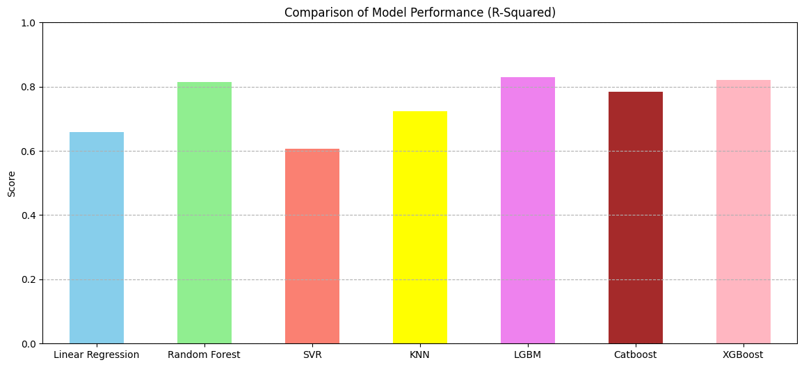

### _Summary_
# 📊 Prediksi Harga Rumah di California

Notebook ini berisi proses lengkap dalam membangun model prediksi harga rumah di California 
berdasarkan dataset dari [Kaggle](https://www.kaggle.com/datasets/camnugent/california-housing-prices). 

Kami menerapkan alur standar Machine Learning, mulai dari _EDA, Preprocessing, Feature Engineering,_ hingga penerapan beberapa model regresi dan klasifikasi.

---

## 🔍 Konteks Dataset

Dataset ini berasal dari sensus California tahun 1990 dan digunakan pada bab kedua buku Hands-On Machine Learning with Scikit-Learn and TensorFlow karya Aurélien Géron.

Dataset ini merupakan versi modifikasi dari kumpulan data Perumahan California yang tersedia di:
Halaman Luís Torgo (University of Porto) -> https://www.dcc.fc.up.pt/~ltorgo/Regression/cal_housing.html

Variabel yang terdapat dalam dataset ini mencakup:

* Jumlah kamar tidur dan total kamar
* Populasi dan jumlah rumah tangga
* Lokasi (latitude dan longitude)
* Kedekatan dengan laut (`ocean_proximity`)
* Nilai tengah harga rumah (`median_house_value`), yang menjadi target prediksi

---

## ⚙️ Langkah-Langkah Analisis

### 1. **Exploratory Data Analysis (EDA)**

* Pemeriksaan tipe data dan nilai yang hilang (null)
* Pembersihan data dengan menghapus baris kosong
* Analisis korelasi antar fitur numerik
* Visualisasi distribusi awal data menggunakan histogram

### 2. **Preprocessing**

* Transformasi logaritmik (`np.log1p`) pada kolom:

  * `total_rooms`, `total_bedrooms`, `population`, dan `households`
* Encoding kategorikal (`ocean_proximity`) menggunakan one-hot encoding
* Pembuatan dua fitur baru:

  * `bedroom_ratio` = total\_bedrooms / total\_rooms
  * `household_rooms` = total\_rooms / households

### 3. **Modeling**

Beberapa algoritma digunakan untuk membandingkan performa prediksi nilai median rumah:

* Linear Regression
* Random Forest
* Support Vector Regressor (SVR)
* K-Nearest Neighbors (KNN)
* LightGBM (LGBM)
* CatBoost
* XGBoost

Model dilatih menggunakan data latih dan dievaluasi menggunakan data uji dengan metrik R-Squared (R²).

---

## ✅ Hasil & Kesimpulan

* **Model regresi LGBM** menunjukkan performa **terbaik** dibanding dari antara semua model, karena kemampuannya menangkap hubungan non-linear dan interaksi antar fitur.
* **Transformasi logaritma** sangat membantu dalam memperbaiki distribusi dan meningkatkan stabilitas model.
* **Feature engineering** sederhana (rasio kamar tidur dan total ruangan) berkontribusi dalam meningkatkan korelasi terhadap harga rumah.
